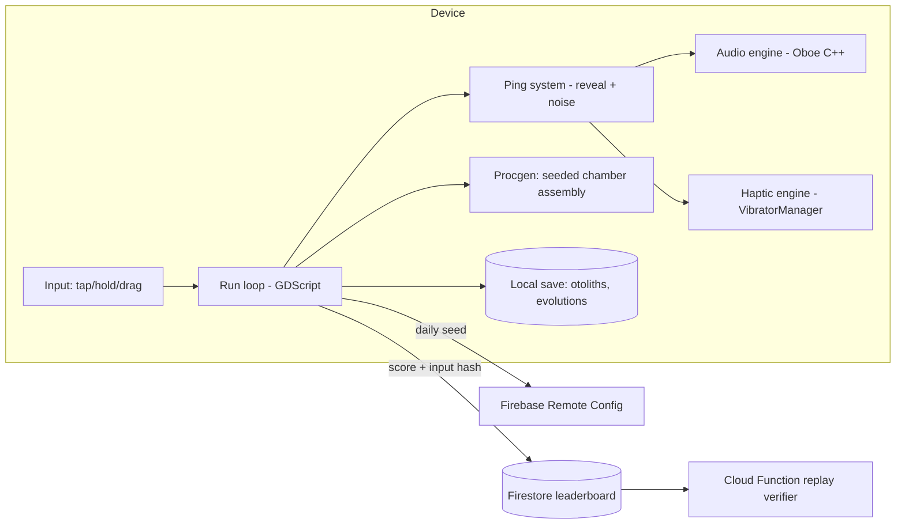

# EchoDepths — to see is to be seen

You are a blind cave salamander in a flooded labyrinth a kilometer under the earth. The screen is black. You tap, and a ring of sound blooms outward, painting the cavern walls in fading phosphor lines — the ledge above you, the tunnel splitting left, the smooth swell of something large and alive that just turned toward the noise. EchoDepths is a one-thumb roguelite where light does not exist and sound is both your only sense and your greatest liability. Every ping buys you vision and sells your position. The entire game lives inside that trade.

## 1. Overview
- **Elevator pitch:** A near-black-screen echolocation roguelite. Tap to ping; sound reveals geometry as fading luminous outlines and simultaneously alerts predators that hunt by hearing. Descend through procedurally generated flooded caverns, evolve new senses between runs, and learn to move through remembered darkness.
- **Category:** Game — atmospheric roguelite / stealth puzzle. Portrait, one-thumb, session length 5–15 minutes.
- **Tagline:** *To see is to be seen.*
- **Play Store positioning:** "The horror-tinged roguelite you can play with your eyes closed — literally. Full spatial-audio and haptic play mode, designed with and for blind players."

## 2. Problem & Why Now
Mobile roguelites are saturated with brawlers and deckbuilders that all compete on the same axis: more builds, more meta. Almost none compete on *sensory design*. Meanwhile the two most-praised mobile games of recent years (Alto's Odyssey for mood, Vampire Survivors for compulsion) prove that a single strong feeling beats a feature list. EchoDepths' feeling — dread and mastery in darkness — is untouched territory on Play.

There is also a genuine underserved audience: blind and low-vision players. Audio games exist but are ghettoized in tiny catalogs with poor production values. A game where the *canonical* experience is audio-and-haptic first, where sighted players are the ones adapting, inverts that — and it is exactly the kind of accessibility story Google's editorial team features (Play Store "made for everyone" collections). Spatial audio APIs, high-quality haptics (Android `VibratorManager` with amplitude control), and low-latency audio (AAudio/Oboe) are now mature enough on mid-range devices to make this shippable by a solo dev.

## 3. Target Audience & Personas
- **Mira, 27, UX designer, London.** Plays Slay the Spire on commutes with earbuds always in. Wants games that respect a 10-minute session and feel *crafted*. She will find EchoDepths through a "best atmospheric games" listicle and stay for the daily-run leaderboard.
- **Deven, 34, blind since 19, Pune.** Plays audio games and MUDs; frustrated that mainstream games treat accessibility as a menu toggle bolted on late. EchoDepths' "Eyes Closed mode" is not a mode — it is the game. He becomes a community evangelist; blind-community word of mouth is dense and loyal.
- **Sam, 41, lapsed core gamer, Toronto.** Owns a Steam Deck they never touch. Wants one premium-feeling mobile game without ads or energy timers. Pays the one-time unlock happily and leaves the five-star review that mentions "no ads" in the first line.

## 4. Core Concept Deep-Dive
The core loop is a three-way economy between **information, noise, and time**.

- **Pings** come in three intensities, controlled by hold duration. A *click* (tap) reveals a 3-meter radius faintly for 2 seconds and makes 1 noise. A *chirp* (short hold) reveals 8 meters clearly for 4 seconds, 3 noise. A *shout* (long hold) reveals the whole chamber for 6 seconds, 8 noise — and shouts echo, so their noise persists in the water for several seconds as a lingering "scent trail" of sound.
- **Noise** fills a hidden per-predator awareness meter. Bristlemaws drift toward the last sound source; Anglers hold still and lash at anything that pings within range; the Warden — the mid-boss of each biome — permanently escalates its patrol speed each time you shout. Predators emit their own sounds (bristle clicks, angler lure hum, warden bellows), which the game renders in spatial audio and directional haptic pulses, so you can track them without pinging at all.
- **Memory** is the third resource, and the design's soul. Revealed geometry fades from bright phosphor to dim ember to nothing over ~6 seconds. Skilled players ping once, hold the map in their head, and drift silently through blackness using momentum and the haptic "wall brush" cue (a soft buzz when you graze a surface). The game constantly asks: how much of what you remember do you trust?

Movement is one-thumb: touch and drag anywhere to set a swim vector; the salamander drifts with water currents (currents hum, and their hum tells you their direction — sound as level design). Release to glide silently. There is no attack. You survive by routing, baiting (throw a pebble: a consumable that pings *somewhere else*), and evolving.

**Roguelite structure:** Runs descend through 4 biomes — Rootwater Shallows, the Chimney Forest, the Still Black, and the Warden's Throat — each 3 procedurally assembled chambers plus a set-piece. Death is permanent for the run; you keep **Otoliths** (ear-stones), the meta-currency, spent in the Grotto between runs on evolved senses: *Lateral Line* (feel moving creatures within 4m as directional haptics), *Heat Pits* (predators glow faint red without pinging), *Fat Reserves* (one extra hit), *Barbels* (loot detection), *Vocal Sac* (a fourth, ultra-quiet ping tier). Each evolution changes how the game feels sensorially, not just numerically — that is the meta-progression hook.

**The emotional hook:** the moment the screen has fully faded to black, something bellows to your left, and you *choose not to ping* — navigating five seconds of pure memory and haptics while your pulse spikes. No other mobile game manufactures that moment.

## 5. Complete Feature Set
**MVP (v1.0):**
- Core ping/stealth/swim loop with three ping tiers and lingering echo trails.
- 4 biomes, 10 chamber archetypes each, seeded procedural assembly; one Warden boss per biome.
- 6 predator species with distinct audio/haptic signatures.
- Meta-progression: Grotto hub, 12 evolutions across 3 branches (Sense, Body, Voice).
- Eyes Closed mode: full spatial audio + haptic language (wall brush, predator direction pulses, current hum), TalkBack-navigable menus, haptic tutorial. Certified by blind playtesters before launch.
- Daily Descent: fixed seed for all players, one attempt, global leaderboard (depth reached), shareable spoiler-free result card.
- One-time premium unlock (see Monetization); first biome free.
**v1.x fast-follows:**
- Pebble crafting variants (sticky pebble, double-echo pebble); 8 more evolutions.
- "Cartographer" replay: after death, see your whole run's path drawn as sonar art; savable as wallpaper — a built-in share loop.
- Weekly modifier runs (e.g., "Loud Water": all pings +1 noise, rewards doubled).
**v2.0+:**
- Biome 5 (the Sunless Sea) with open-water navigation by whale-song landmarks.
- Endless mode below the final boss with escalating pressure mechanic.
- Community seed sharing ("beat my cave").

## 6. Screen-by-Screen UX Walkthrough
Navigation model: single stack, no tab bar. The game is the home screen.
- **Title/Dive screen:** black, a single slow sonar ring pulsing; DIVE, DAILY DESCENT, GROTTO, OPTIONS as text in phosphor type. Tap-holds mirror in-game ping verbs (tiny teaching moment).
- **Run screen:** 95% blackness; thumb-zone drag area is the whole screen; depth meter (top-left, subtle), noise meter as a widening ring around your salamander, pebble count bottom-right. No HUD chrome beyond this.
- **Death screen:** the sonar-art path of your run draws itself; Otoliths earned tick up; single button: SURFACE.
- **Grotto (meta hub):** a cross-section cave illustration; three tunnel branches = three evolution trees; long-press an evolution to *feel* its haptic preview before buying — you can try a sense before you own it.
- **Daily Descent intro:** shows the global "depth histogram" of today's players before you dive; after your one attempt, your placement bar drops into the histogram — instantly legible, instantly shareable.
- **Options:** audio mix (music/ambience/cues), haptic strength calibration wizard, Eyes Closed toggles, colorblind-safe phosphor palettes (green/amber/ice).
**Key flow — first 90 seconds (onboarding):** cold open in blackness, no logo. Text: "Tap." Ring blooms, revealing the tutorial nursery. "Hold." Chirp reveals a passage — and wakes a distant bristle-click. The game teaches fear before it teaches mechanics. Two chambers later you earn your first pebble and the title card finally appears. Time-to-wow: under 60 seconds.
**Key flow — the shout decision:** chamber 2-3 archetypes are designed with one geometry too complex to memorize from chirps, forcing the player's first shout — and their first Warden escalation — as an authored dramatic beat that procedural assembly preserves.

## 7. Design Language
Visual style is *instrument, not illustration*: pure black field; geometry rendered as 1.5px phosphor strokes with bloom, fading through green → ember → black; predators as negative space that sound outlines only partially (you never see all of anything). Typography: a single mono-grotesque (Space Grotesk) in phosphor green, all-lowercase menus. Motion: everything eases like water; UI transitions are sonar wipes. Sound: binaural ambience per biome (drips at distinct pitches per chamber size — pitch encodes room scale), predator leitmotifs, no music during runs except one heartbeat-synced drone in boss chambers; full dynamic mix ducks ambience when cues matter. Haptics: a designed vocabulary — wall brush (soft 40ms), predator bearing (directional double-pulse, stronger = closer), current (slow sine), damage (hard 120ms) — calibrated per-device via the options wizard.

## 8. Technical Architecture
Opinionated stack: **Godot 4 (GDScript + one GDExtension in C++ for audio/haptics)**. Godot's node system suits 2D procedural assembly; the C++ extension wraps **Oboe/AAudio** for sub-20ms audio latency and `VibratorManager` amplitude control — the two things that must never stutter. Rendering is trivial (strokes + bloom shader), so min-spec reaches Android 8 / 2GB devices. Backend is nearly nil by design: **Firebase** for auth-less anonymous IDs, daily seed distribution (Remote Config), leaderboard (Firestore) and crash reporting. Runs are fully offline; only Daily Descent needs a connection at dive-time. Anti-cheat for the leaderboard: the client submits an input-trace hash; a Cloud Function replays flagged traces headlessly (Godot server build) before showing top-100 entries.

Offline strategy: everything except Daily is local; daily attempts made offline are queued and submitted with the trace when connectivity returns (marked "late" on leaderboard). Save data: single local JSON, cloud-backed via Play Games Saved Games.

## 9. Data Model
- **PlayerProfile** (local + Play Games sync): `player_id`, `otoliths`, `evolutions[]`, `settings{haptic_cal, audio_mix, palette, eyes_closed}`, `stats{runs, max_depth, shouts, silent_clears}`.
- **Run** (local, transient): `seed`, `biome_index`, `chamber_index`, `noise_events[]`, `pebbles`, `hp`, `input_trace` (ring buffer).
- **DailyResult** (Firestore): `date`, `player_id`, `depth`, `duration_ms`, `trace_hash`, `client_version`, `late:bool`.
- **Evolution** (static content): `id`, `branch`, `cost`, `sense_effects[]`, `haptic_preview_pattern`.
- **ChamberArchetype** (static): `id`, `biome`, `geometry_graph`, `spawn_table`, `authored_beats[]`.

## 10. Monetization
Premium unlock, no ads, no consumable IAP — the trust position *is* the marketing. Biome 1 (about 40 minutes of play plus Daily Descent forever) is free. **"Full Depths" one-time unlock: $5.99** (tier-priced: ₹299 India, and Play's lower-tier pricing elsewhere) opens biomes 2–4, all evolutions, weekly modifiers. One cosmetic-only IAP line later: "Phosphor palettes" pack $1.99. Conversion logic: the free tier ends on a cliffhanger — the biome-2 door opens with a bellow from below and the paywall copy is one line: *"It heard you. Keep going?"* Target 4–6% free→paid conversion (premium unlocks in atmospheric titles with strong onboarding routinely hit 3–8%); Daily Descent keeps unconverted players returning, and each return is another paywall impression with fresh context.

## 11. Play Store Listing
- **Title (≤30):** `EchoDepths: Sonar Roguelite` (27 chars)
- **Short description (≤80):** `Ping to see. Stay silent to survive. A roguelite played in total darkness.` (75)
- **Full description draft:** Open on the fantasy ("A kilometer below the surface, light has never existed…"), then three feature blocks — *See With Sound* (ping economy), *Evolve Your Senses* (meta), *Play Eyes Closed* (accessibility, spatial audio, haptics) — then the no-ads/premium pledge, then Daily Descent. Close with the accessibility statement and blind-playtester credit, which doubles as differentiation.
- **ASO keywords:** sonar game, echolocation, roguelite, dark cave game, stealth game offline, audio game for blind, horror roguelike, no ads premium game, one hand game, atmospheric indie.
- **Content rating:** IARC — likely Teen (horror themes, no gore, no violence depicted). No user content, no data collection beyond anonymous leaderboards → clean Data Safety form (leaderboard ID only, not linked to identity).
- **Policy notes:** none sensitive; ensure the "designed for blind players" claim is substantiated in-listing (screenshots of Eyes Closed mode) to satisfy metadata accuracy policy; include seizure-safe note (no flashing above threshold).

## 12. Growth & Marketing Plan
Launch beats: (1) closed beta with blind-gamer communities (AudioGames.net forum, r/Blind, Applevis crossover) — their endorsement is authentic and quotable; (2) a 60-second trailer that is *audio-first*: black screen, binaural sound, the words "put your headphones on" — inherently shareable because it is a novelty even as a video; (3) pitch Google Play editorial for accessibility featuring (Indie Corner + "made for everyone"); (4) press angle for outlets that cover accessibility (The Verge, GameSpot's accessibility desk). Built-in loops: Daily Descent result cards (depth + histogram position, no spoilers), sonar-art death maps as wallpapers with a small watermark. Community: a Discord where weekly modifier runs are voted on. Content marketing: a devlog series on "designing a game you can't see" — the kind of process content that front-pages r/gamedev and Hacker News.

## 13. Analytics & KPIs
North star: **D7 retention among players who finished the tutorial** (target ≥ 18%). Key events: `tutorial_complete`, `first_shout`, `first_silent_clear`, `daily_attempt`, `paywall_view`, `unlock_purchase`, `eyes_closed_enabled`, `evolution_bought`, `death{biome, cause}`. Health thresholds: tutorial completion ≥ 70%; median session ≥ 8 min; daily-run participation among D7 retained ≥ 40%; free→paid ≥ 4%; crash-free sessions ≥ 99.5%. A special metric worth watching: % of runs completed with zero shouts — if it climbs above 30%, the noise economy needs rebalancing.

## 14. Risks & Mitigations
- **Haptic fragmentation** (cheap devices lack amplitude control): ship a calibration wizard and a degraded "pattern-only" haptic set; never gate playability on haptics — audio carries the full signal.
- **"Black screen" store perception** (screenshots look empty): screenshots use long-exposure composite renders of ping trails — beautiful sonar art, honest to gameplay.
- **Difficulty alienation:** an "Abyssal Calm" assist mode (slower predators, longer fade) — clearly labeled, leaderboard-ineligible, guilt-free.
- **Leaderboard cheating:** trace-replay verification (above); top-10 manually reviewed at first.
- **Solo-dev audio scope:** license a binaural ambience library for base layers; hand-design only the 20 signature cues.
- **Play policy:** minimal — keep Data Safety honest; IARC horror rating done early to avoid listing rework.

## 15. Competitive Landscape
- **Dark Echo** (RAC7, 2015): the closest ancestor — sound-line visualization, but a linear puzzle game, long abandoned; no roguelite structure, no accessibility mode, no live content. EchoDepths is its systemic, living successor.
- **A Blind Legend** (audio adventure): audio-only but linear, narrative, dated production; not a systems game.
- **Vampire Survivors / mobile roguelites:** own the compulsion loop but zero atmosphere; EchoDepths competes for the same session slot with an opposite feeling.
- **Lethal Company / Iron Lung (PC, tonal comps):** prove "dread in confined dark spaces" has a large young audience; nobody has brought it to mobile natively.
- **Alto's Odyssey:** the premium-mood benchmark; EchoDepths borrows its business model and polish bar, not its calm.

## 16. Development Plan
Solo dev, ~26 weeks to launch. W1–3: greybox ping/fade/noise prototype, fun-test the core (kill criterion: if pinging isn't tense by week 3 with placeholder art, stop). W4–7: audio engine (Oboe extension), haptic vocabulary, calibration. W8–12: procgen chambers, 6 predators, biome 1 complete vertical slice. W13–16: biomes 2–4, Wardens, evolutions. W17–18: Eyes Closed certification round with paid blind playtesters (budget $1,500). W19–20: Daily Descent + Firebase + trace verification. W21–22: onboarding polish, store assets, trailer. W23–24: closed beta (500 players), balance. W25–26: launch buffer. **If behind:** cut biome 4 to v1.1, cut weekly modifiers, never cut the calibration wizard or Eyes Closed — they are the moat.

## 17. Moonshots
- **Echo PvP "Sounding":** asynchronous — plant three noise-lures in your daily cave; friends' runs inherit them.
- **Real-room mode:** use phone speaker + mic actively (chirp into your actual room, game reacts to real echo delay) — a research toy that would generate press by itself.
- **Whale-song biome with live data:** the Sunless Sea's landmark songs generated from real hydrophone feeds (Monterey Bay MBARI streams).
- **Haptic vest / controller support** for accessibility conferences and museum installations.
- **"Descent Together":** two phones, one cave — one player hears, one player sees pings only; couch co-op via shared audio space.
